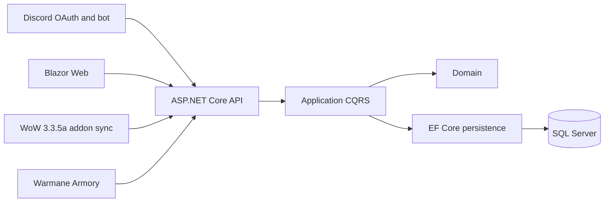

# Architecture overview

Warmane Raid Manager separates player identity, synchronized character state and raid planning into distinct domain
features. The website and future Discord bot are presentation channels over the same application API.

## Domain boundaries

- **Identity** owns the local application profile linked to a Discord snowflake identifier.
- **Characters** owns Warmane identity, verification, loadouts, synchronization freshness and raid lockouts.
- **Communities** owns Discord-backed raid communities and membership roles.
- **Raids** owns raid events, requirements, signups, offered loadout choices and final roster selections.

## Data ownership rule

Gear, GearScore, talents, glyphs and combat statistics belong to a **loadout**.
Raid lockouts belong to the **character**.
This prevents the common Armory limitation where only the currently worn gear can represent a character's raid
capability.
