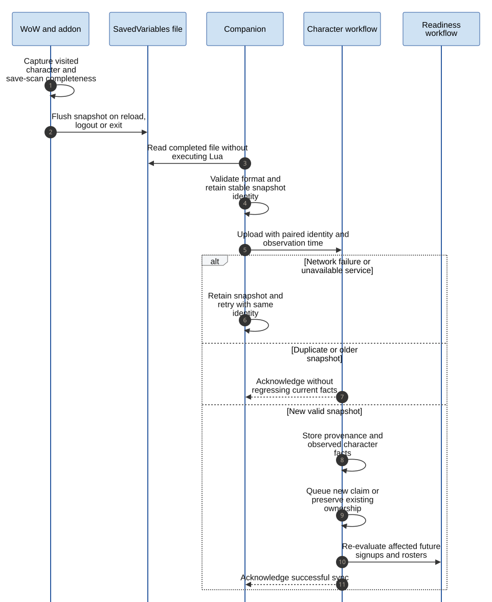
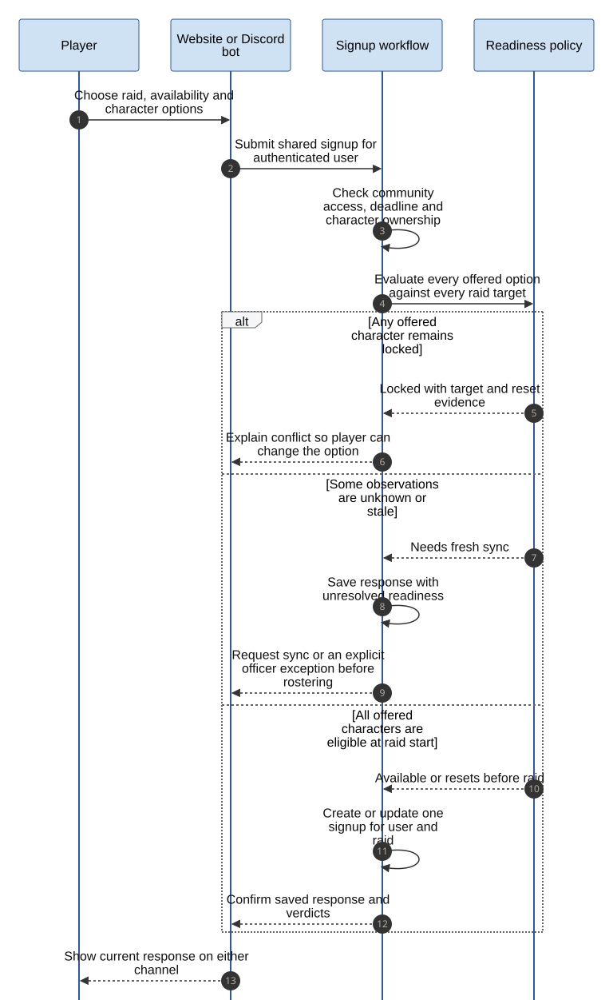

# Architecture and implementation status

RaidManager follows Clean Architecture with separate Identity, Characters, Communities, and Raids domain areas.
The solution targets .NET 10, C# 14, Blazor, ASP.NET Core, SQL Server, Aspire, and Pivot.Framework.
The first [Architecture Decision Record (ADR)](../adr/README.md) records Discord-only authentication and
Warmane-first data sources. The [companion ADR](../adr/0002-use-desktop-companion-for-character-sync.md) records
the upload path.

The [version 1 visual guide](visual-guide.md) contains the complete use-case, domain, component, sequence,
state, and readiness diagrams. The views below provide the starting context.

## Current scaffold

The application programming interface (API) exposes only a foundation endpoint and development OpenAPI document.
The web app renders a placeholder page. The Discord worker logs its startup and waits; it has no interaction gateway.
The Aspire AppHost starts the API, web app, bot host, and a local SQL Server resource.
The Domain project contains initial aggregates and value objects. The Application project has the first commands, to
approve or reject a character claim. The Entity Framework Core project persists the `Character` aggregate on SQL
Server and records domain events in an outbox table; nothing delivers them yet. No host sends commands yet.
There is no addon or companion project yet.

## System context

This is the intended version 1 product boundary. Players and officers use RaidManager through the website and
Discord; WoW and Warmane Armory supply character facts. These connections are planned, not implemented.
[Mermaid source](../diagrams/context.mmd).

## Current local containers

The current local setup runs placeholder web, API, and bot processes under Aspire.
The arrows labeled as service references are configuration only: they do not imply working product calls or
database persistence. This is a local-development view, not a deployed production topology.
[Mermaid source](../diagrams/container.mmd).

## Intended data flow

The addon collects data through World of Warcraft (WoW) in-game APIs and stores snapshots in SavedVariables.
WoW writes those variables to disk on reload, logout, or exit. A paired desktop companion observes the files and
uploads snapshots over an authenticated connection to the API.
The API links new characters to a pending approval queue for the paired Discord identity.
The next website sign-in leads the player to review them before they can be used for signups.
The companion must expose monitored folders, pairing and retry status; uploads should be idempotent and must not
place authentication secrets in addon files.

Warmane Armory remains a source for public character facts where reliable.
Addon snapshots provide details that the Armory cannot reliably represent, especially multiple loadouts and raid
lockouts. Each imported fact needs source and observation time so the website can show freshness and avoid treating
an absent value as a confirmed negative.

## Ownership and raid rules

- **Identity** links one local user to a Discord identity. Discord is the only planned sign-in provider.
- **Characters** owns character identity, approval state, loadouts, sync provenance, and raid lockouts.
- **Communities** owns Discord-backed raid groups and membership roles.
- **Raids** owns schedules, target instances and difficulties, signups, offered loadouts, and roster selections.

Gear, GearScore, talents, glyphs, and combat statistics belong to a loadout.
Raid lockouts belong to the character and identify an instance, difficulty, and reset time.
Eligibility is computed at the scheduled raid start, in Coordinated Universal Time (UTC), rather than at the
moment of signup. Unknown or stale lockout data requires a new sync before eligibility can be confirmed.
The first-version application rules distinguish available, resets-before-raid, locked-through-raid, and
needs-fresh-sync verdicts per raid target. A confirmed active lock blocks signup and roster assignment.
An officer can roster an unknown character only with a recorded, visible reason; that action does not convert
the verdict to available.

The website and bot should use the same application rules so a character rejected for a raid on one channel is
not accepted on the other. Exact API requests and event contracts will be documented when implemented.
The same application state also owns recurring raids, signup availability, roster publication, attendance,
and notifications. Re-evaluate impacted signups and rosters after snapshots or raid schedule changes.
The addon roster export uses the current published composition, not a separate officer-maintained list.

## Planned character synchronization

The planned addon saves a visited character's data when WoW writes its SavedVariables file.
The companion uploads a complete snapshot; the player approves newly discovered characters before signup.
[Mermaid source](../diagrams/character-sync.mmd).

## Planned raid decision

The website and bot use one signup and one readiness decision for each raid target.
The officer publishes a roster only after reviewing candidates, then exports it for the addon on raid night.
[Mermaid source](../diagrams/raid-readiness.mmd).

