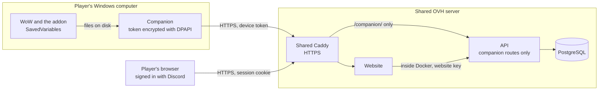
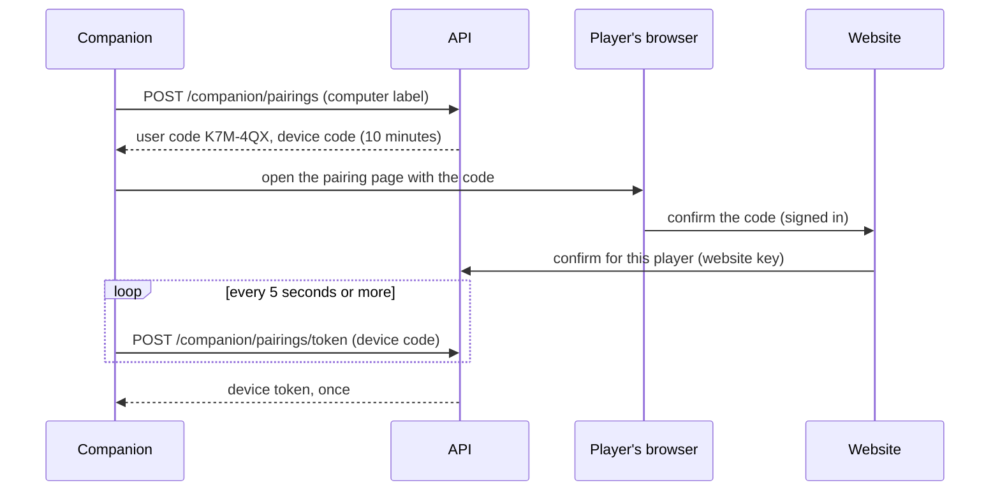

# Companion pairing and claim threat model

This document lists what can go wrong when the desktop companion pairs with a player's account, uploads character
snapshots and claims characters, and how each threat is handled. The decisions are in
[ADR-0030](../adr/0030-pair-the-companion-with-a-confirmed-code.md); the companion's role is in
[ADR-0002](../adr/0002-use-desktop-companion-for-character-sync.md). It answers spike #37, and the stories that
build on it are #15, #17 and #171.

## What is protected

| Asset | Why it matters |
| --- | --- |
| A player's RaidManager identity | Uploads and claims act in its name. |
| Character ownership | It decides who signs up with a character and who an officer can roster. |
| Raid saves and loadouts | Readiness and roster decisions trust them. |
| The companion's device token | Whoever holds it uploads as the player. |
| WoW account folder names | They are WoW login names, half of the player's game credentials. |
| The website key and the server | Out of scope here; ADR-0011, ADR-0027 and ADR-0028 cover them. |

## Who might attack

- **Another player** who wants a character that isn't theirs, or wants to look ready for a raid.
- **Someone on the internet** who finds the public `api.` hostnames.
- **Someone who tricks a player** into confirming a pairing code.
- **Malware or another person** on the player's computer, or whoever gets a sold or lost computer.

## Trust boundaries

- Everything on the player's computer is under the player's control, including the snapshot files.
- The internet reaches the API only through Caddy, and only on `/companion/...` routes.
- The website confirms pairings and revokes companions for the signed-in player; it talks to the API inside Docker.

## Pairing

## Threats and how they are handled

| Threat | Mitigation | What remains |
| --- | --- | --- |
| Guessing a pairing code to pair a computer to someone's account | The player confirms a code on their own signed-in session; codes have 887 million values, last 10 minutes and are single-use; wrong codes are rate-limited per player. | None of note. |
| Tricking a player into confirming the attacker's code (phishing) | The page shows the code, the computer's label and the request time and asks to pair only one's own computer; a pairing only ever creates pending claims the player must approve, and the paired computers list shows and revokes it. | A careless player can be fooled; the damage is pending claims and visible, revocable access. |
| Stealing the device token over the network | HTTPS only, ended by Caddy with Let's Encrypt. | None of note. |
| Stealing the token from the computer | The token is encrypted with DPAPI for the Windows user, never in WoW folders, SavedVariables or logs. | Malware running as the player can use it while it runs; revoking the computer ends it. |
| A sold, lost or forgotten computer | The player revokes it from the website at once; a companion unused for 180 days expires. | Access until revocation or expiry. |
| Replaying a captured upload | HTTPS; each snapshot has an id the API remembers per companion, so a repeat is acknowledged without import; future observation times are refused. | None of note. |
| Flooding the API through `/companion/` | Rate limits on pairing creation per address and on uploads per companion; size limits on snapshots. | Volume attacks beyond the server's capacity are out of scope. |
| Claiming another player's character with one's own companion | An upload never transfers ownership: the claim enters conflict review, and an officer decides with evidence: claim times, observation history, snapshot counts, and whether both claims come from the same WoW account (a keyed fingerprint). | The officer's judgment; a shared WoW account looks the same for both players, by design. |
| Learning a player's WoW login from RaidManager | The API keeps only an HMAC of the account folder name with a per-environment secret and never stores or logs the name; officers never see either. | The name crosses HTTPS once per upload. |
| Editing snapshot files to fake gear or raid saves | Snapshots are the player's own data: the website marks their source and observation time, and officers see them; an older complete raid-save scan never replaces a newer one. | Accepted: RaidManager can't verify game files; officers stay the judges of readiness. |
| Using a revoked companion | Every request checks the token in the database, so revocation applies at the next request. | None of note. |

## Out of scope and open questions

- The companion's installer, code signing and updates (supply chain) belong to the companion's packaging work.
- macOS and Linux support, which needs their own secure stores (owner decision on #37: Windows only at first).
- The website key, the server and the deployed secrets: ADR-0011, ADR-0027 and ADR-0028.
