# Components and boundaries

These views explain the intended version 1 responsibilities and communication paths.
They are logical architecture views, not a claim about a deployed environment.
The [current local diagram](architecture.md#current-local-containers) shows the existing Aspire scaffold.

## System context

Players and officers use one platform backed by Discord identity and game observations.
The addon and companion mediate the WoW connection; the game does not send website requests directly.

Source: [Mermaid](../diagrams/context.mmd).

## Product components

The website and bot share an application programming interface (API).
The companion uploads completed snapshots; the API owns shared state and readiness decisions.

Source: [Mermaid](../diagrams/component-system.mmd).

The website's Discord edge represents the sign-in journey.
Token exchange and identity checks belong to the server-side workflow shown in the sign-in sequence.
The PostgreSQL box records the chosen persistence technology
([ADR-0029](../adr/0029-store-data-in-postgresql.md)), without inventing a production hosting service.

## Shared API components

Transport and authorization route requests to domain-specific workflows.
Readiness is a shared policy; delivery coordination handles reminders and material changes.

Source: [Mermaid](../diagrams/component-api.mmd).

These components fit the existing Clean Architecture boundaries:

- Containers adapt website, bot, and companion requests.
- Application coordinates commands, queries, validation, and external contracts.
- Domain holds character, community, signup, and roster rules.
- Infrastructure implements persistence and external adapters.

A box is a responsibility, not a proposed microservice.
No additional message broker or scheduling product is selected by this drawing.

## Addon and companion components

The addon observes in-game state and produces saved data.
The companion reads complete files from approved folders and uploads them with revocable authorization.

Source: [Mermaid](../diagrams/component-device.mmd).

The parser treats SavedVariables as data and does not execute arbitrary Lua from a file.
The roster importer receives an officer-exported roster; it is not an inbound HTTP connection to the addon.
Invitation controls require an officer action and must respect the supported client's game APIs.
