# Version 1 domain model

The domain model explains business concepts and their relationships.
It extends the current C# foundation to cover the agreed version 1 workflows.
These are conceptual types; a box does not imply an implemented class, a table, or a separate aggregate.

A multiplicity such as `0..*` means zero or more; `1..*` means one or more.
A filled diamond means the child belongs to that concept's lifecycle.
Each composed child has one owning parent; repeated parent-side `1` labels are omitted where they would overlap.
Other relationships refer to identities rather than requiring an in-memory object graph.

## Domain overview

A community organizes raids, a user offers character loadouts, and an officer selects one option per player.
Character ownership and saved-instance state remain independent of the selected loadout.

Source: [Mermaid](../diagrams/domain-overview.mmd).

## Identity and community

A membership associates one user with one community and its scoped role.
That same user can authorize companion pairings and request character claims across multiple game accounts.

Source: [Mermaid](../diagrams/domain-identity.mmd).

## Characters and observations

Pairings authorize uploads, snapshots preserve observation evidence, and claims control approval.
Gear belongs to a loadout; raid saves belong to a character.

Source: [Mermaid](../diagrams/domain-characters.mmd).

| Concept | Responsibility and invariant |
| --- | --- |
| User | Local identity linked to Discord. One user may own characters on several WoW accounts. |
| CompanionPairing | Revocable permission for a companion to upload for one user. Credentials stay outside addon files. |
| CharacterSnapshot | Versioned observation from a specific source. Duplicate or older input must not regress current facts. |
| ObservationMetadata | Source, observation time, and receipt time. Freshness uses observation time rather than upload time alone. |
| CharacterClaim | Pending, approved, rejected, or conflicted request to associate a character with a user. |
| Character | Realm and character identity, approved owner, and character-wide raid saves. |
| Loadout | Spec, role, gear, GearScore, talents, glyphs, stats, and their provenance. |
| RaidLockout | Instance, difficulty, lockout identifier, reset, extension, and available progress evidence. |

An empty lockout collection is meaningful only with evidence of a complete and fresh scan.
An omitted save list or failed scan remains unknown.
Manual facts need their own source label, including when the current code's source enum does not yet support them.

## Raid planning

A raid has required targets and one response per user.
Alternative compositions, bench entries, boss assignments, and attendance refer back to the same participants.

Source: [Mermaid](../diagrams/domain-raids.mmd).

| Concept | Responsibility and invariant |
| --- | --- |
| RaidTemplate and RecurrenceRule | Reusable settings and the local-time rule for creating distinct raid occurrences. |
| RaidTarget | One required instance and difficulty in a possibly combined raid. |
| RaidSignup | One response for a raid and user, regardless of whether it was edited on the website or in Discord. |
| SignupOption | An approved character and loadout offered by that user, with notes and preference where applicable. |
| SignupPreset | Reusable choices; loading a preset still requires current ownership and readiness checks. |
| RaidComposition | A draft or published alternative with a revision for reviewing changes. |
| RosterSelection | One selected option per user in a composition; a roster position cannot be occupied twice. |
| BenchEntry | A substitute candidate, distinct from a selected participant and from availability. |
| BossAssignment | Encounter-specific responsibility associated with a selected participant. |
| EligibilityAssessment | Derived verdict for a character, target, start time, and current evidence. |
| OfficerException | Visible reason attached to an unknown-data assessment. It cannot authorize a confirmed active lock. |
| AttendanceRecord | What happened for a player at a raid, distinct from their earlier intended availability. |

Publication validates each selected option against all required targets.
A new observation or changed schedule invalidates the relevance of the old assessment and requires re-evaluation.
Reusing an officer exception against changed evidence requires renewed review.

## Relationship to current code

The current types are under `src/Core/RaidManager.Domain/Features/`, grouped by domain area.
The diagrams above describe the version 1 target model.
A diagram concept is not an implemented class merely because it appears there.

| Current foundation | Version 1 design extension |
| --- | --- |
| `Identity/Aggregates/User.cs` and `Communities/Aggregates/Community.cs` exist. | Discord sign-in, sessions, pairing and permission workflows need implementation. |
| `Characters/Aggregates/Character.cs` has an owner and ownership flag. | Explicit claim lifecycle, evidence, conflict handling and mandatory approval page are planned. |
| `Characters/Aggregates/Loadout.cs` and raid lockouts exist. | Complete-scan evidence, snapshot history, source-specific freshness and manual-source handling are planned. |
| `Raids/Aggregates/Raid.cs` has one instance and difficulty. | Multiple targets, recurrence, composition revisions and re-evaluation are planned. |
| `Raids/Aggregates/RaidSignup.cs` stores options and a status. | Availability and assignment must become independent; the current enum includes Selected and Bench. |
| `Raids/Aggregates/RosterSelection.cs` supports one selection per user. | Multiple draft compositions, publication review, boss assignments and attendance are planned. |

No relational schema is asserted here because persistence mappings are not implemented.
Generate a storage diagram from the real schema when that exists.
