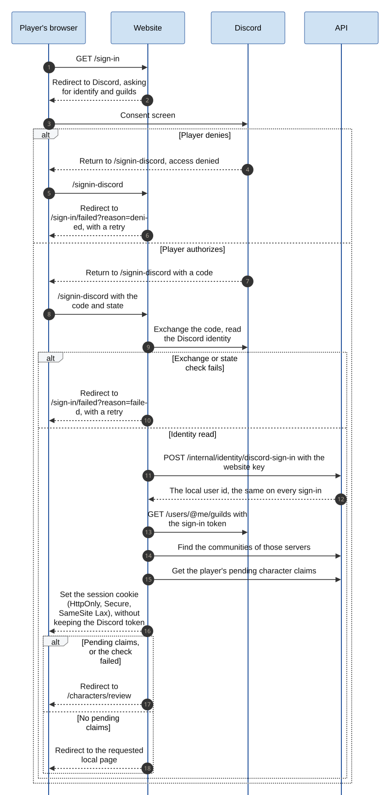
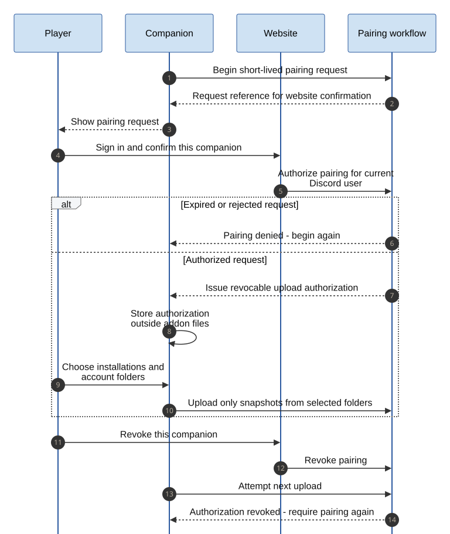
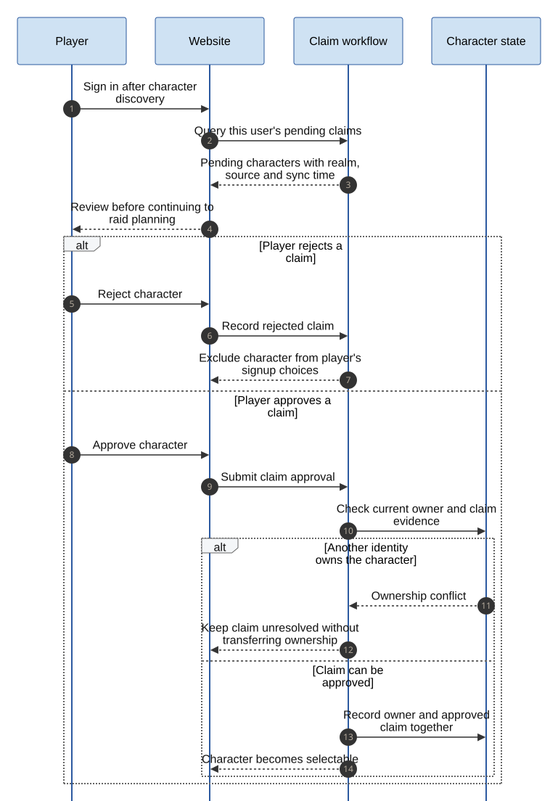

# Account and character sequences

These sequences show the actor and component responsibilities behind onboarding and synchronization.
The sign-in sequence shows the built flow with its real routes; the others are still planned, and their application
programming interface (API) messages are conceptual operations.

## Discord sign-in

The website owns the sign-in, as [ADR-0011](../adr/0011-website-session-and-api-trust.md) decides. It runs the Discord
authorization exchange itself and asks the API, with its website key, for the player's local user id. Then it looks up
the player's communities and pending claims, and sets its own session cookie. The Discord token is never stored.
A denied or failed authorization ends on a failure page with a retry.
Pending claims, or a claim check that fails, send the player to the review page; otherwise they return to the page
they asked for.

Source: [Mermaid](../diagrams/sequence-sign-in.mmd).

## Companion pairing

The signed-in player authorizes a specific companion request and can revoke it later.
The handshake is a proposed implementation shape; short expiry and revocation are required behavior.

Source: [Mermaid](../diagrams/sequence-pairing.mmd).

No game-account password or website authentication secret belongs in the addon data file.
The companion monitors only installations and accounts selected by the player.

## Snapshot synchronization

The game must flush saved data before the companion can upload it.
Retries keep the same snapshot identity, and delayed snapshots must not overwrite newer observations.

Source: [Mermaid](../diagrams/character-sync.mmd).

A successful upload acknowledges ingestion, not character approval.
For example, a player can sync three newly visited characters while all three remain pending.
An unavailable service leaves the snapshot pending locally with a visible retry status.

## Character approval

Approval checks the current owner; rejection removes the candidate from signup choices.
Conflicts remain unresolved until an authorized evidence-review process resolves them.

Source: [Mermaid](../diagrams/sequence-character-approval.mmd).

A repeated upload does not reverse a rejection or transfer ownership.
The exact conflict-review authority and ownership evidence are design details requiring validation.
