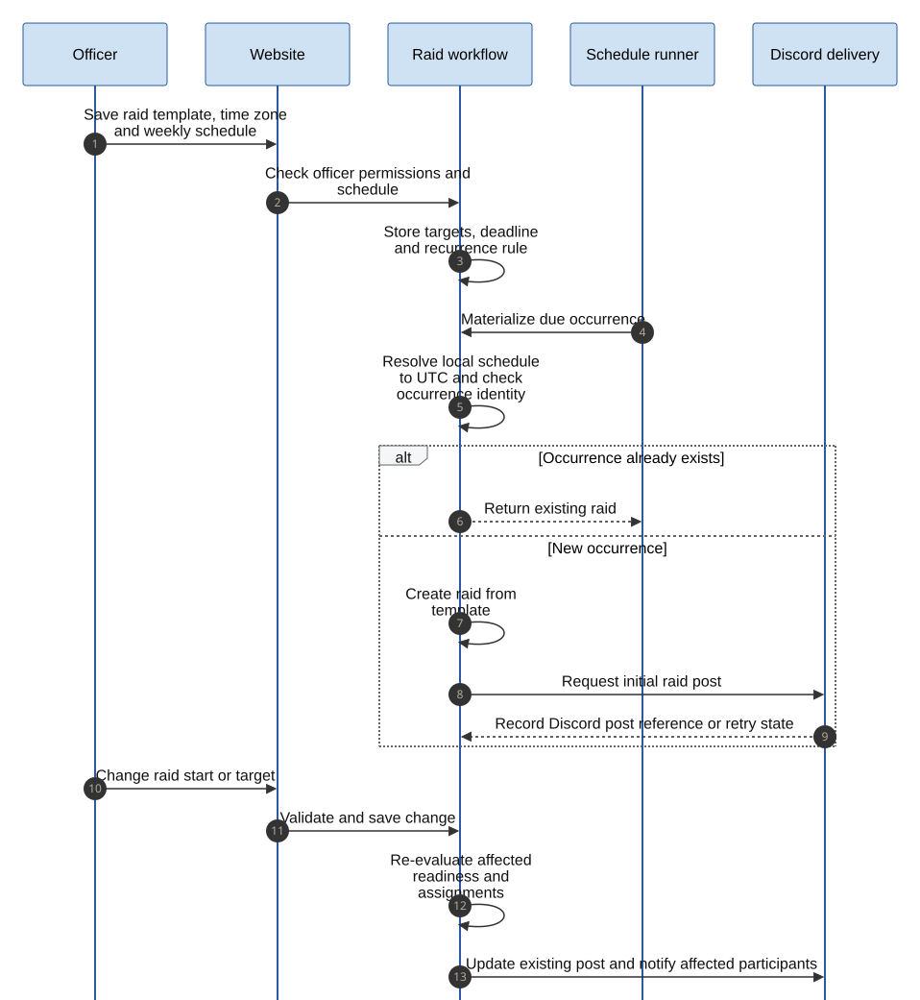
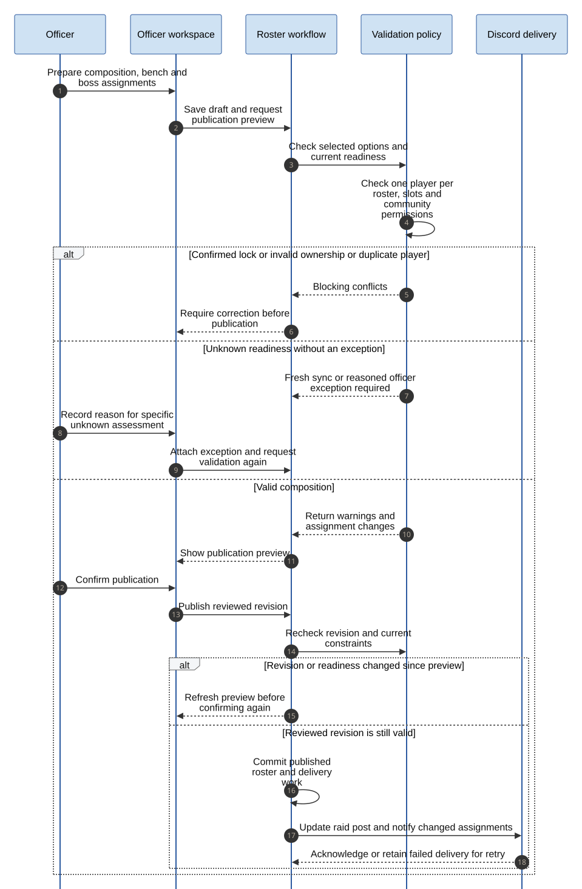
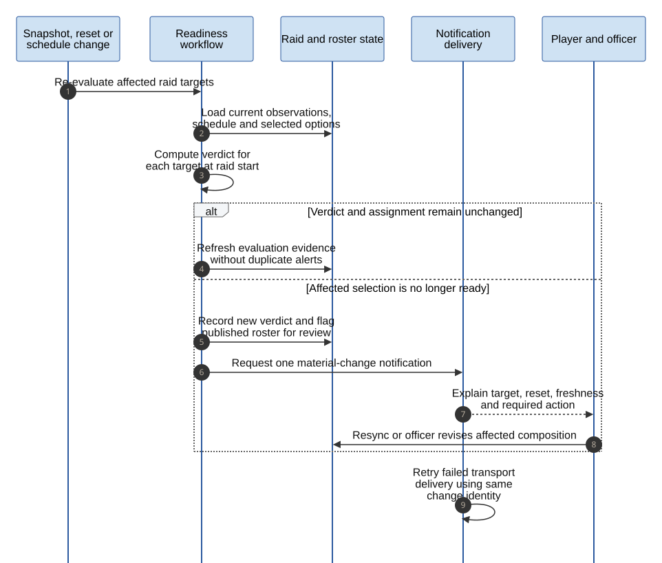
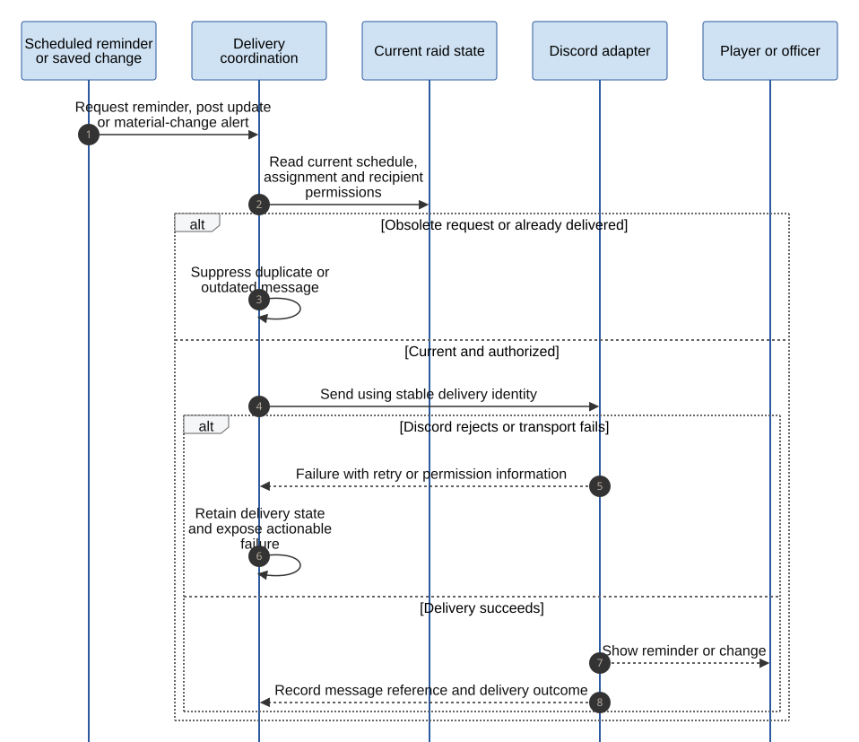
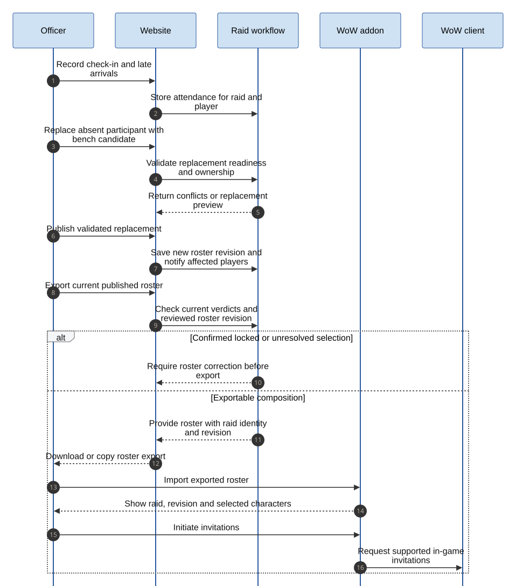

# Raid planning and raid-night sequences

These sequences show the planned first-version behavior through the shared application programming interface (API).
Database operations and transport delivery are abstracted so the diagrams remain about business behavior.

## Shared signup

Both channels create or update the same response for a user and raid.
Ownership, permissions, deadline, and per-target lockouts are checked before returning a result.

Source: [Mermaid](../diagrams/raid-readiness.mmd).

The sequence shows a response offering characters.
A declined response needs no character option, and withdrawal removes the player's active offer.
Unknown options can remain in a response, but publication requires fresh evidence or an explicit officer exception.
Saving a preset does not bypass validation when that preset is applied to another raid.

## Scheduling and recurrence

A recurrence creates one raid for each occurrence and retains its Discord post reference.
Changing an occurrence's schedule re-evaluates participants and updates the existing post.

Source: [Mermaid](../diagrams/sequence-scheduling.mmd).

The local schedule is resolved into Coordinated Universal Time (UTC) for each occurrence.
Daylight-saving transitions and ambiguous local times must be handled explicitly when implementing recurrence.
The schedule runner is a logical role; its hosting and scheduling library are not yet selected.

## Roster publication

Officers review conflicts and assignment changes before publishing.
The confirmation rechecks the reviewed revision so a concurrent edit cannot silently change what was approved.

Source: [Mermaid](../diagrams/sequence-publication.mmd).

The unknown-data branch records an exception and returns to validation; it does not publish immediately.
Warnings about gear or buff coverage are advisory.
Confirmed active locks, invalid ownership, duplicate participants, and occupied slots remain blocking.

## Readiness changes

New snapshots, resets, and schedule changes recompute affected readiness.
An invalidated published assignment becomes visible to the player and officer without automatic replacement.

Source: [Mermaid](../diagrams/sequence-reevaluation.mmd).

For example, a character that was free when selected can become saved before raid night.
The roster then needs review even though the earlier signup was valid.

## Reminders and notifications

Delivery uses current raid information and recipient permissions.
Obsolete messages are suppressed, and failures remain visible for retry or permission repair.

Source: [Mermaid](../diagrams/sequence-notifications.mmd).

A stable delivery identity prevents the website and bot from independently scheduling the same logical alert.
A transport timeout can leave delivery uncertain; reconciliation must use a known Discord message reference
where possible rather than claiming exactly-once delivery over an unreliable network.

## Raid night

Attendance records actual participation; a substitute swap still needs current validation.
The officer imports a versioned roster into the addon and initiates invitations in the game.

Source: [Mermaid](../diagrams/sequence-raid-night.mmd).

An addon export is a point-in-time copy and cannot know about later website changes by itself.
Show the raid and revision on import; after a roster change, the officer must use a fresh export.
Boss-specific assignments and bench information accompany the relevant published plan.
