# States, readiness, and evidence

The states below describe the intended first-version behavior.
They refine the current foundation, which does not yet implement these complete lifecycles.

## Character claim

A new discovery needs review before the character can be offered.
New uploads refresh evidence but cannot approve a rejected claim or transfer another user's character.

Source: [Mermaid](../diagrams/state-character-claim.mmd).

## Raid lifecycle

Raid scheduling and signup closure are independent from composition publication.
An officer can continue reviewing a composition after signups close.

Source: [Mermaid](../diagrams/state-raid.mmd).

The current `RaidStatus` enum also contains `RosterPublished`; the target design separates publication below.
Cancellation exists as a foundation enum value. The transition rules in this view are a proposed lifecycle refinement.

## Signup response

A player may begin with any availability response and edit it while raid rules permit.
An edit stays in Responded; withdrawing an offer is distinct from declining attendance.

Source: [Mermaid](../diagrams/state-participation.mmd).

| Availability | Meaning |
| --- | --- |
| Confirmed | Plans to attend with one of the offered options. |
| Tentative | May attend; officer sees the uncertainty. |
| Late | Supplies an expected arrival time. |
| Declined | Does not plan to attend; no character option is required. |

Selected, benched, and absent are not availability choices.
Selection belongs to a composition; absence belongs to attendance.

## Composition publication

A composition moves through review before publication.
Changes to evidence or schedule can require review even when the composition itself has not been edited.

Source: [Mermaid](../diagrams/state-composition.mmd).

A draft revision does not replace the currently published revision until it is confirmed.
The diagram models work on a composition; the last published snapshot remains available while edits are reviewed.

## Raid-start readiness

For each required target, resolve realm rules and evaluate complete, fresh evidence at the raid start.
A combined raid is blocked by any confirmed active lock; otherwise any unknown target keeps the result unknown.

Source: [Mermaid](../diagrams/readiness-decision.mmd).

Ownership approval and a matching realm are preconditions to this flow.
An unknown mapping or uncertain extension never becomes a confirmed free save.
An exception is a recorded decision to roster despite unknown data, not a new readiness verdict.

| Example | Result |
| --- | --- |
| Fresh save resets Tuesday; raid starts Wednesday. | Resets before raid. |
| Fresh save resets Thursday; raid starts Wednesday. | Locked through raid. |
| A complete fresh scan finds no matching save. | Available. |
| The snapshot contains no save list or is stale. | Needs fresh sync. |
| Icecrown is available but required Ruby Sanctum remains locked. | Combined raid is blocked. |
| Officer records a reason for unknown data. | Verdict stays unknown; roster contains a visible exception. |

The exact reset boundary and extension semantics must follow validated realm rules.
Do not infer free access from a generic calendar when actual save evidence contradicts it.

## Data provenance

Game snapshots, public Armory facts, and player-reported edits have different authority.
Readiness and gear warnings retain the source and freshness of the facts they use.

Source: [Mermaid](../diagrams/data-provenance.mmd).
