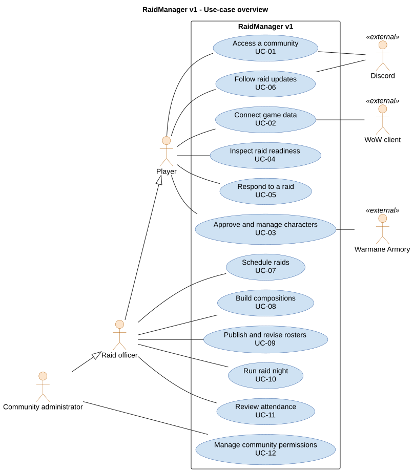
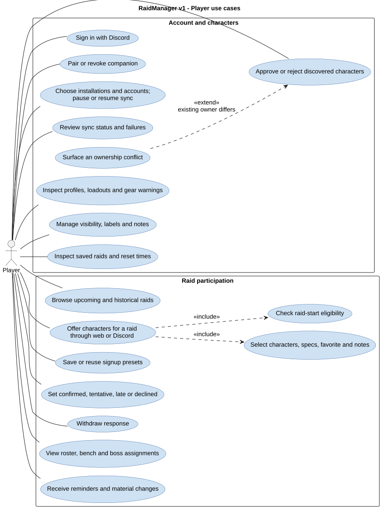
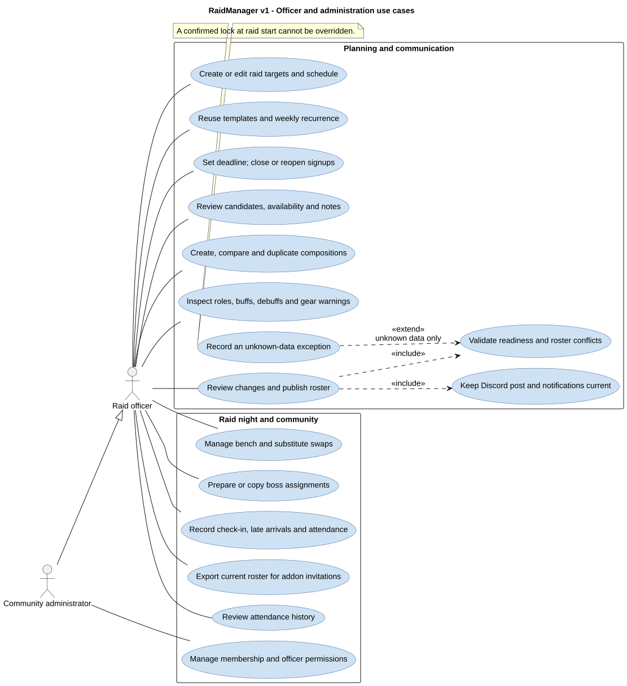

# Version 1 use cases

These diagrams cover player, raid officer, and community administrator goals.
An officer also has player capabilities; a community administrator also has officer capabilities.
Actual permissions remain scoped to the selected community.

## Complete goal map

The full goal map covers the website, Discord bot, addon, and companion as one RaidManager system.
Discord, the WoW client, and Warmane Armory are supporting external actors.

Source: [PlantUML](../diagrams/use-cases-overview.puml).

| Goal | Version 1 behavior | Detailed flow |
| --- | --- | --- |
| UC-01 Access a community | Discord sign-in, local identity, membership and permission checks. | [Sign-in](sequence-identity.md#discord-sign-in) |
| UC-02 Connect game data | Pair and revoke companion, select account folders, pause sync, observe failures and retries. | [Pairing and sync](sequence-identity.md#companion-pairing) |
| UC-03 Manage characters | Approve or reject discovery, surface conflicts, inspect profiles, edit reported fields and visibility. | [Approval](sequence-identity.md#character-approval) |
| UC-04 Inspect readiness | View saves, resets, freshness, per-target verdicts and gear warnings. | [Readiness](state-models.md#raid-start-readiness) |
| UC-05 Respond to a raid | Offer multiple specs, choose a favorite, add notes, reuse presets, set availability or withdraw. | [Signup](sequence-raids.md#shared-signup) |
| UC-06 Follow raid updates | View assigned character, bench and boss plan; receive reminders and material changes. | [Delivery](sequence-raids.md#reminders-and-notifications) |
| UC-07 Schedule raids | Create and edit targets, templates, weekly recurrence, time zone, deadline, and signup closure. | [Scheduling](sequence-raids.md#scheduling-and-recurrence) |
| UC-08 Build compositions | Search candidates; duplicate and compare drafts; inspect role, buff, debuff and gear coverage. | [Publication](sequence-raids.md#roster-publication) |
| UC-09 Publish rosters | Review changes, validate conflicts, record unknown-data exceptions and notify selected or benched players. | [Re-evaluation](sequence-raids.md#readiness-changes) |
| UC-10 Run raid night | Check attendance, handle late arrivals, swap substitutes, use boss assignments and export invitations. | [Raid night](sequence-raids.md#raid-night) |
| UC-11 Review attendance | Inspect participation history across raids. | [Raid planning model](domain-model.md#raid-planning) |
| UC-12 Manage permissions | Maintain community membership and officer permissions. | [API components](components.md#shared-api-components) |

## Player detail

A player can use the website or Discord for participation, while the companion manages local synchronization.
The ownership-conflict extension interrupts approval; it does not transfer another player's character.

Source: [PlantUML](../diagrams/use-cases-player.puml).

The character/spec selection subcase applies when offering characters.
A declined response can omit character options.
Presets copy choices into the current raid response; every copied choice is checked again for that raid.
Manual edits remain player-reported and never replace authoritative synchronized save evidence.

## Officer and administration detail

Officers review candidates, publish compositions, and manage raid-night changes.
The exception extension applies only to unknown data; confirmed active locks remain blocking.

Source: [PlantUML](../diagrams/use-cases-officer.puml).

In UML, an `include` relationship marks required behavior in the relevant use case.
An `extend` relationship marks conditional behavior.
Notification dispatch is required after a material publication change, but transport completion can follow later.
Community administration does not imply authority to transfer ownership of another account's character.
